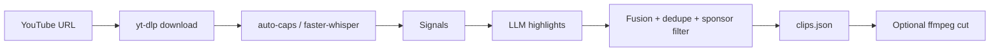

# ClipClipper

<p align="center">
  <a href="https://www.python.org/downloads/"></a>
  <a href="LICENSE"></a>
  
  
  
</p>

<p align="center"><strong>Rank the best moments in long YouTube videos</strong> — fused LLM + replay + audio signals → <code>clips.json</code>, optional MP4 cuts.</p>

<p align="center">
  <a href="#requirements">Requirements</a> ·
  <a href="#quick-start">Quick start</a> ·
  <a href="#free-to-run">Free to run</a> ·
  <a href="#cli-reference">CLI</a> ·
  <a href="#configuration">Config</a> ·
  <a href="docs/UPLIFT_PLAN.md">Design</a>
</p>

## About

**ClipClipper** is an open-source YouTube **clip-finding engine**: paste a long video URL and get a ranked [`clips.json`](#clipsjson-excerpt) with start/end times, titles, hooks, and scores you can explain (LLM + Most Replayed + audio energy + chapters, fused per video).

The pipeline runs **locally** — `yt-dlp`, `faster-whisper`, and Gemini (free tier) or OpenAI on your hardware. Optional ffmpeg cuts stay at **source aspect ratio** (no forced 9:16 crop, no clip SaaS API). A separate `captions.py` adds SRT/ASS or burn-in for editors.

## Features

- **Ranked clip candidates** — start/end times, titles, hooks, virality notes, and per-signal scores
- **Multi-signal fusion** — LLM ranking + Most Replayed heatmap + loudness/spikes + chapter hints (weights renormalize when a signal is missing)
- **Local-first pipeline** — `yt-dlp` download, `faster-whisper` transcript, Gemini or OpenAI for highlights
- **Auto-captions shortcut** — uses YouTube's own captions when available, skipping Whisper entirely (faster, no GPU)
- **SponsorBlock exclusion** — sponsor/intro/outro segments are fetched and clips landing inside them are dropped
- **Caching** — re-runs reuse download, transcript, audio curve, and heatmap; skip completed videos unless `--force`
- **Batch queue** — multiple URLs or a `.txt` file; parallel workers (2× speed on multi-video runs); summary in `output/queue_report.json`
- **Desktop studio (GUI)** — native PySide6 app: drag-and-drop URLs, live pipeline log, per-clip cards with signal breakdown, render/preview actions
- **Optional render** — ffmpeg cuts at source aspect ratio (no vertical crop, no third-party video API)
- **Captions helper** — SRT, karaoke ASS, optional burn-in via `captions.py`

## Requirements

| Dependency | Purpose |
|------------|---------|
| **Python 3.10+** | Runtime |
| **[ffmpeg](https://ffmpeg.org/)** | Download merge, audio analysis, optional cuts and caption burn |
| **API key** | `GEMINI_API_KEY` (free tier — default) **or** `OPENAI_API_KEY` (see `.env.example`) |

Install Python packages:

```bash
pip install -r requirements.txt
```

Copy environment template and add your key:

```bash
cp .env.example .env
```

For GPU Whisper, install PyTorch separately (CPU works without it; see comment in `requirements.txt`).

## Quick start

```bash
# Timestamps + clips.json (default)
python main.py "https://www.youtube.com/watch?v=VIDEO_ID"

# Several videos or a URL list
python main.py URL1 URL2 URL3 --num-clips 5
python main.py urls.txt

# Also export ranked MP4 segments
python main.py urls.txt --render

# Frame-accurate cuts (slower re-encode)
python main.py urls.txt --render --accurate-cut
```

## Free to run

ClipClipper is wired to cost $0 by default:

1. **LLM_PROVIDER=gemini** is the out-of-the-box default — Gemini 2.5 Flash has a free tier generous enough for personal use. Set `OPENAI_API_KEY` + `LLM_PROVIDER=openai` only if you prefer it.
2. **AUTO_SUBS=true** — when YouTube provides captions for a video, they are fetched and used directly; `faster-whisper` (the CPU/GPU-heavy step) is skipped entirely. Whisper remains the automatic fallback for videos without captions.
3. **One LLM call per video** — content-type classification was folded into the highlight prompt, so short videos cost a single round-trip instead of two.
4. **SponsorBlock** uses the free public `sponsor.ajay.app` API (no key) to keep ad-reads out of your clips.

The only remaining cost is the highlight-ranking LLM call. On Gemini's free tier that is effectively free for tens of videos per day; everything else (download, transcription when auto-subs are missing, audio energy, fusion, cuts) runs on your machine with deps that ship in `requirements.txt`.

To force local Whisper even when captions exist: `AUTO_SUBS=false`. To disable SponsorBlock: `SPONSORBLOCK=false`.

## Output

Each video is written under `output/<video_id>/`:

```
output/<video_id>/
  source_<id>_max.mp4      # cached download (quality tag matches --format)
  source_<id>_max.srt      # cached transcript
  audio_energy.json        # loudness / spike / pause curve
  heatmap.json             # YouTube Most Replayed (when available)
  clips.json               # primary result
  1_slug.mp4               # only with --render
```

### `clips.json` (excerpt)

```json
{
  "video_id": "6G0bG6qWqTs",
  "video_title": "...",
  "source_url": "https://...",
  "duration": 1873.4,
  "clips": [
    {
      "rank": 1,
      "name": "the-one-mistake-that-cost-me-50k",
      "title": "The one mistake that cost me $50K",
      "start_time": 124.3,
      "end_time": 187.6,
      "start_hms": "00:02:04.3",
      "end_hms": "00:03:07.6",
      "score": 92,
      "llm_score": 88,
      "hook_sentence": "...",
      "virality_reason": "...",
      "transcript_excerpt": "...",
      "context_expanded": true,
      "signals": {
        "llm": 0.91,
        "replay": 0.80,
        "audio": 0.55,
        "chapter": 1.0,
        "final_score": 92.0,
        "signals_present": ["audio", "chapter", "llm", "replay"]
      }
    }
  ]
}
```

- **`score`** — fused 0–100 rank used for ordering  
- **`llm_score`** — raw model score before fusion  
- **`signals`** — which inputs contributed and how  

On low-view videos without heatmap or chapters, missing signals drop out and their weight is redistributed (typically LLM + audio only).

Queue runs append `output/queue_report.json` with `ok` / `failed` entries. Existing `clips.json` is left in place unless you pass `--force` (download and transcript caches are still reused).

## CLI reference

| Flag | Default | Description |
|------|---------|-------------|
| `--num-clips` | `3` | Maximum clips kept per video |
| `--min-score` | `0` | Drop clips below this fused score |
| `--format` | `max` | `max` (best available) or `360` / `480` / `720` / `1080` |
| `--language` | auto | Whisper language code, e.g. `en` |
| `--render` | off | Cut original-ratio MP4s |
| `--accurate-cut` | off | With `--render`, re-encode for frame-accurate boundaries |
| `--force` | off | Re-run analysis even if `clips.json` exists |
| `--no-browser-cookies` | off | Do not load YouTube cookies from the browser |
| `--cookies-from-browser` | — | Override browser (e.g. `edge`, `chrome`, `firefox`, `brave`) |
| `--cookies` | — | Path to Netscape `cookies.txt` instead of browser cookies |

Positional arguments: one or more YouTube URLs, or a `.txt` file with one URL per line.

## YouTube downloads and cookies

Age-restricted, region-locked, or bot-check failures are common without cookies. By default the downloader tries cookies from your browser (configurable in `.env` as `YTDLP_COOKIES_FROM_BROWSER`).

**Recommended for CI or headless use:** export cookies to `cookies.txt` or `cookies.json` in the project root (gitignored) or set `YTDLP_COOKIES_FILE`. File cookies take precedence over browser cookies.

```bash
python main.py "https://www.youtube.com/watch?v=..." --cookies path/to/cookies.txt
python main.py "..." --no-browser-cookies
```

See `.env.example` for `YTDLP_PLAYER_CLIENTS` and related yt-dlp tuning.

## Studio — desktop GUI

A native Qt desktop app (PySide6) around the same pipeline — **not** a web app:

```bash
pip install -e .[gui]        # or: pip install PySide6
python -m studio_app         # or: clipclipper-gui
```

- **Drag and drop** — drop `urls.txt` files or pasted YouTube URLs straight into the queue; drag rows to reorder
- **Two modes** — *YouTube Clips* (rank + download) or *TikTok Download* (watermark-free video + title + thumbnail + stats, no ranking)
- **Parallel processing** — the queue runs 2 videos at once (downloads are network-bound); Stop cancels cleanly
- **Live pipeline log** — every `[download]` / `[transcribe]` / `[signals]` line streams into the Log tab
- **Per-clip cards** — score badge, hook, virality reason, transcript excerpt, LLM/replay/audio/chapter signal bars, and actions: *Render MP4*, *Open in YouTube* (seeks to the timestamp), *Copy JSON*
- **Thumbnails** — YouTube and TikTok result cards show the video thumbnail + title
- **Settings tab** — edits the same `.env` knobs the CLI uses, applied on the next run

### TikTok downloads (no watermark)

Select **TikTok Download** in the Studio queue, drop TikTok video URLs, and each is saved to
`output/tiktok/<video_id>/` with the title, author, view/like/comment counts and thumbnail.

- Watermark-free: selects yt-dlp formats that skip TikTok's watermarked `download` format
- For the most reliable extraction, install impersonation support:
  `pip install -e .[tiktok]` (curl-cffi helps pass TikTok's JS challenge)
- Read-only, no login, no account risk — same as visiting the page
- TikTok rate-limits aggressively; the queue paces itself with a configurable
  per-video delay (Settings → *TikTok pacing*, default 8s) and retries once
  with backoff; failed downloads report per video

## Captions

Works on any local video file (including rendered clips):

```bash
python captions.py output/VIDEO_ID/1_the-hook.mp4
python captions.py clip1.mp4 clip2.mp4 --burn
```

Produces `.srt` (editors) and styled `.ass` (karaoke highlight). `--burn` hard-burns ASS via ffmpeg.

Environment: `CAPTION_FONT`, `CAPTION_FONT_SIZE`, `CAPTION_HIGHLIGHT_COLOR`, `CAPTION_MAX_WORDS`.

## Configuration

All knobs live in `.env`. Common settings:

| Variable | Default | Notes |
|----------|---------|--------|
| `LLM_PROVIDER` | `gemini` | `gemini` (free tier, default) or `openai` |
| `OPENAI_API_KEY` / `GEMINI_API_KEY` | — | Required for chosen provider |
| `LOCAL_WHISPER_MODEL` | `base` | `tiny` → `large-v3` |
| `LOCAL_WHISPER_DEVICE` | `auto` | `auto` / `cpu` / `cuda` |
| `LOCAL_OUTPUT_DIR` | `output` | Output root |
| `DOWNLOAD_FORMAT` | `max` | Same options as `--format` |
| `AUTO_SUBS` | `true` | Use YouTube captions, skip Whisper when present |
| `AUTO_SUBS_LANGS` | `en` | Comma list, e.g. `en,en-orig` |
| `SPONSORBLOCK` | `true` | Exclude sponsor/intro/outro segments via sponsor.ajay.app |
| `RERANK_WEIGHTS` | see `.env.example` | LLM / replay / audio / chapter fusion |
| `AUDIO_ENERGY` | `true` | ffmpeg + numpy loudness scoring |
| `PEAK_LEAD_SECONDS` / `PEAK_TAIL_SECONDS` | `5` / `5` | Context around replay peaks |
| `DEDUPE_SIMILARITY` | `0.6` | Transcript overlap threshold for near-duplicates |

Full list and defaults: [`.env.example`](.env.example).

## How it works



1. Download (cached) — max quality by default, MP4-preferred merge
2. Transcribe (cached) — YouTube auto-captions when available, else faster-whisper
3. Collect replay heatmap, chapters, audio energy, semantic boundaries, SponsorBlock segments
4. LLM ranks candidate moments (hinted by peaks and structure; classifies content in the same call)
5. Fuse signals into a calibrated per-video score; expand peaks for setup → payoff
6. Dedupe by time and transcript similarity; drop clips inside sponsor segments; snap to sentence boundaries
7. Write `clips.json` (+ sidecar JSON); optionally `--render` cuts

Design notes and validation: [`docs/UPLIFT_PLAN.md`](docs/UPLIFT_PLAN.md). Replay holdout eval:

```bash
python -m eval.replay_holdout urls.txt
```

## Project layout

Generated and tooling artifacts stay out of git: `output/` (runs), `graphify-out/` and `.graphify_*` (optional local graphify analysis), plus `.env` and cookie files — see [`.gitignore`](.gitignore).

```
main.py                   Clip-finding CLI
captions.py               Standalone captions CLI
studio_app/               Desktop GUI (PySide6, optional: pip install -e .[gui])
  app.py                  QApplication entry + env bootstrap
  main_window.py          Queue + results + settings + log layout
  pipeline_worker.py      QThread queue runner with live log capture
  tiktok_worker.py        QThread TikTok downloader runner
  queue_list.py           Drag-and-drop URL queue + YouTube/TikTok mode
  clip_card.py            Clip + TikTok result cards, thumbnails, background render
  settings_panel.py       .env settings editor
  theme.py                Dark professional stylesheet
requirements.txt
.env.example
docs/UPLIFT_PLAN.md      Signal fusion design + validation notes
eval/replay_holdout.py    Ranking eval without manual labels
shorts_generator/
  pipeline.py             find_clips() orchestration
  queue.py                Multi-URL processing + parallel workers + queue report
  tiktok.py               Watermark-free TikTok downloader + queue
  signals.py              Heatmap, chapters, audio, boundaries
  rerank.py               Fusion, peak expansion, dedupe
  highlights.py           LLM ranking + boundary snap
  downloader.py           yt-dlp (YouTube + metadata for signals)
  transcriber.py          faster-whisper / auto-captions
  llm.py                  OpenAI / Gemini
  clipper.py              ffmpeg cut (no crop)
  captions.py             SRT / ASS / burn
  config.py
```

## License

[MIT](LICENSE) — use and modify freely; attribution appreciated.
